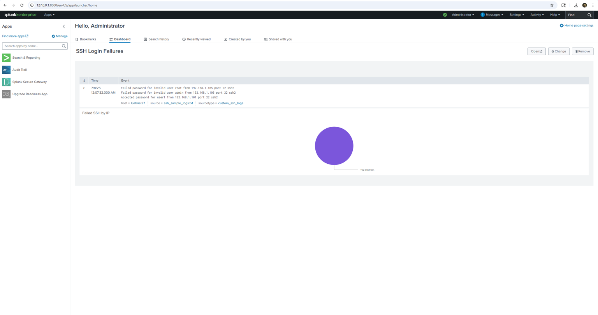

# Splunk SSH Brute Force Detection Lab

## Overview

This project demonstrates the use of Splunk Enterprise to investigate SSH authentication activity, identify failed login attempts, extract source IP addresses, create dashboard visualizations, and configure alerting for potential brute-force attacks.

The goal was to simulate the workflow of a Security Operations Center (SOC) analyst performing log analysis and threat investigation.

---

## Objectives

- Import SSH authentication logs into Splunk Enterprise
- Create a custom sourcetype for SSH log analysis
- Investigate failed and successful login attempts
- Extract source IP addresses using SPL and regex
- Visualize authentication activity using dashboards
- Create alerts for potential brute-force attacks
- Practice incident investigation workflows

---

## Environment

### Software

- Splunk Enterprise
- Windows Host System

### Data Source

- SSH Authentication Logs
- Custom Sourcetype: `custom_ssh_logs`

---

## Skills Demonstrated

- Splunk Enterprise
- SIEM Operations
- Log Analysis
- Security Monitoring
- SPL Queries
- Dashboard Development
- Alert Configuration
- Brute Force Detection
- Incident Investigation
- Threat Analysis

---

## Investigation Workflow

### Step 1 - Import SSH Authentication Logs

I imported SSH authentication logs into Splunk Enterprise using a custom sourcetype called `custom_ssh_logs`.

The logs contained:

- Failed login attempts
- Successful login attempts
- Source IP addresses
- User account activity

### Step 2 - Review Authentication Events

After importing the logs, I reviewed the authentication events to identify failed and successful login attempts.

Examples included:

- Failed password for invalid user root
- Failed password for invalid user admin
- Accepted password for user1

This allowed me to determine which login attempts failed and which accounts were successfully authenticated.

### Step 3 - Count Failed Login Attempts

To identify how many failed login attempts were associated with a specific IP address, I used the following SPL query:

```spl
index=main sourcetype=custom_ssh_logs "Failed password" "192.168.1.105"
| stats count as "Failed Attempts"
```

This query returned the number of failed login attempts associated with that IP address.

### Step 4 - Extract Source IP Addresses

To identify the source of failed login attempts, I used a regex extraction query:

```spl
index=main sourcetype=custom_ssh_logs "Failed password"
| rex "from (?<src_ip>\d{1,3}(?:\.\d{1,3}){3})"
| stats count by src_ip
| where count >= 1
```

This extracted source IP addresses from the SSH logs and grouped them by occurrence count.

### Step 5 - Dashboard Creation

I created a dashboard called **SSH Login Failures** to visualize authentication activity.

The dashboard included:

- Authentication event data
- Failed login tracking
- Pie chart visualization by source IP

### Step 6 - Alert Configuration

I configured a scheduled Splunk alert to detect repeated failed login attempts.

The alert was configured to notify me when repeated failed login attempts were detected. In a real environment, this could help identify potential brute-force activity.

---

## Results

During this lab, I successfully:

- Imported SSH authentication logs into Splunk Enterprise
- Configured a custom sourcetype for SSH log analysis
- Investigated failed and successful login attempts
- Extracted source IP addresses using regex
- Created a dashboard to visualize failed login activity
- Configured an alert for potential brute-force detection

This project helped me gain hands-on experience with SIEM operations, log analysis, dashboard creation, alert configuration, and basic security investigations using Splunk Enterprise.

---

## Screenshots

### Raw SSH Log Investigation


### Failed Login Attempt Analysis


### Source IP Extraction Query


### Dashboard Visualization


